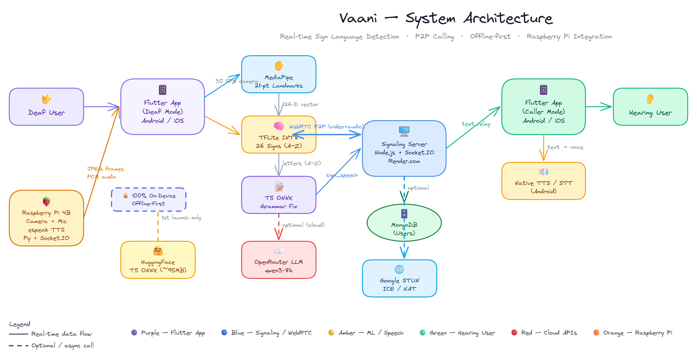

# SYNAPSE / VAANI

## Demo Video

- [Watch Demo: Normal Side](./Vaani_Normal_Side.mp4)
- [Watch Demo: Disable Side](./Vaani_Disable_Side.mp4)

SYNAPSE, branded in the app as VAANI, is an assistive communication system focused on deaf and hard-of-hearing users. It combines on-device sign detection, sentence generation, WebRTC-based calling, watch/overlay support, emergency workflows, and supporting ML and hardware experiments in one repository.

## Overview

The repository is split into three main parts:

- `App2/`: the Flutter mobile application.
- `Backend/`: the Node.js signaling and user-management backend for WebRTC calling.
- `EEG/` and `test/`: ML, EEG, and lightweight experimentation code used for model training and prototyping.

## Architecture



## Main Features

- Real-time sign detection in Flutter using camera input and local inference.
- Deaf and hearing user flows with role-based onboarding.
- Audio and video calling over WebRTC.
- Sign-to-speech relay during calls.
- Caller speech transcription and sign/image presentation.
- Watch and overlay support for live sign display.
- Emergency contact storage and SOS SMS flow.
- On-device and offline-first design choices for privacy-sensitive flows.
- T5 grammar model download on first launch for improved sentence generation.
- EEG-related research code included for future accessibility extensions.

## Tech Stack

### Mobile app

- Flutter
- Provider for state management
- `camera`
- `hand_landmarker`
- `tflite_flutter`
- `onnxruntime`
- `speech_to_text`
- `flutter_webrtc`
- `socket_io_client`

### Backend

- Node.js
- Express
- Socket.IO
- MongoDB with Mongoose

### ML and experiments

- Python
- TensorFlow Lite assets
- EEG data collection and prediction scripts

## Folder Structure

```text
.
|-- App2/         Flutter application
|-- Backend/      Node.js signaling server
|-- EEG/          EEG collection, training, and prediction scripts
|-- final/        Additional Python app code
|-- test/         Model experiments, lightweight classifiers, and demos
|-- Architecture.png
|-- Vaani_Normal_Side.mp4
`-- Vaani_Disable_Side.mp4
```

## Flutter App

The mobile application is the main user-facing product. It supports onboarding for different user roles, live sign recognition, phone/call assistance, tutorial content, emergency features, and hardware-assisted capture flows.

### Important app capabilities

- Role-based routing for deaf and hearing users.
- Local sign classification with bundled assets.
- Downloaded T5 grammar models for sentence cleanup.
- WebRTC call screens for deaf and caller roles.
- Native call bridge and TTS/STT integration.
- Watch overlay and system-audio related support.

### App setup

```bash
cd App2
flutter pub get
flutter run
```

### App requirements

- Flutter SDK compatible with Dart `^3.8.1`
- Android device/emulator for the primary mobile flow
- Camera permission
- Optional `.env` file for any configured secrets or endpoints

## Backend

The backend is a signaling server for WebRTC communication and also exposes REST endpoints for user records.

### Backend features

- User registration with `deaf` and `caller` roles
- Online user presence broadcasting
- Call initiation, acceptance, rejection, and ending
- WebRTC offer/answer/ICE relay
- Sign panel item relay
- Sign speech relay between call participants
- MongoDB-backed user profile persistence

### Backend setup

```bash
cd Backend
npm install
npm start
```

### Backend environment

- `PORT` defaults to `3000`
- `MONGODB_URI` defaults to `mongodb://localhost:27017/synapse`

### Key endpoints

- `GET /health`
- `GET /users`
- `GET /users/:username`
- `PUT /users/:username`
- `DELETE /users/:username`

## ML, EEG, and Experiments

The repository also includes supporting research and prototype code:

- `EEG/` contains EEG recording, training, and live prediction scripts.
- `test/` contains lightweight gesture experiments, training scripts, model exports, web demos, and pretrained assets.
- `final/` contains additional Python-side application logic.

These folders are useful for experimentation and future iteration, even if the main product path is currently the Flutter app plus backend.

## How the System Fits Together

1. The Flutter app captures hand data, performs local detection, and guides the user experience.
2. The backend manages real-time user presence and WebRTC signaling.
3. MongoDB stores user profile information and last-seen data.
4. Optional downloaded language models improve sentence generation on-device.
5. Experimental EEG and model-training code supports future accessibility workflows.

## Notes

- The app title shown in code is `VAANI`.
- The backend package name is `synapse-signaling-server`.
- Some features are designed to be offline-first or privacy-first.
- A few hardware-related values are currently configured directly in code and may need adjustment for your network/device.
